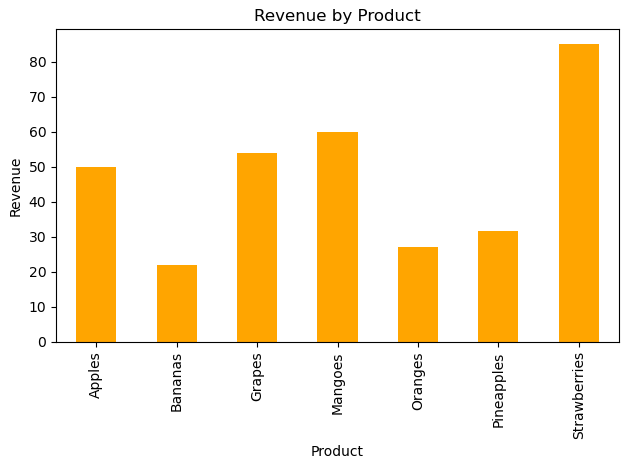

# 🧾 Task 7: Basic Sales Summary from SQLite using Python



## 📌 Objective
Use SQL queries within Python to pull simple sales information such as:
- Total quantity sold per product
- Total revenue per product

Then display the results using:
- A printed summary table
- A simple bar chart

---

## 🛠 Tools Used
- Python
- SQLite (`sqlite3` – built-in)
- Pandas
- Matplotlib
- Jupyter Notebook

---

## 📂 Dataset Overview

We use a SQLite database file named `sales_data.db` with one table: `sales`.

### ➕ Table Schema:
```sql
CREATE TABLE sales (
    id INTEGER PRIMARY KEY,
    product TEXT,
    quantity INTEGER,
    price REAL
);
